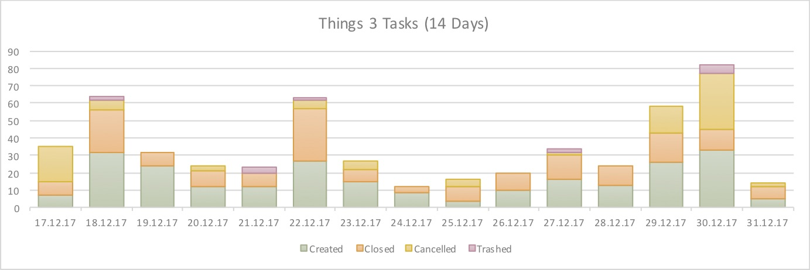
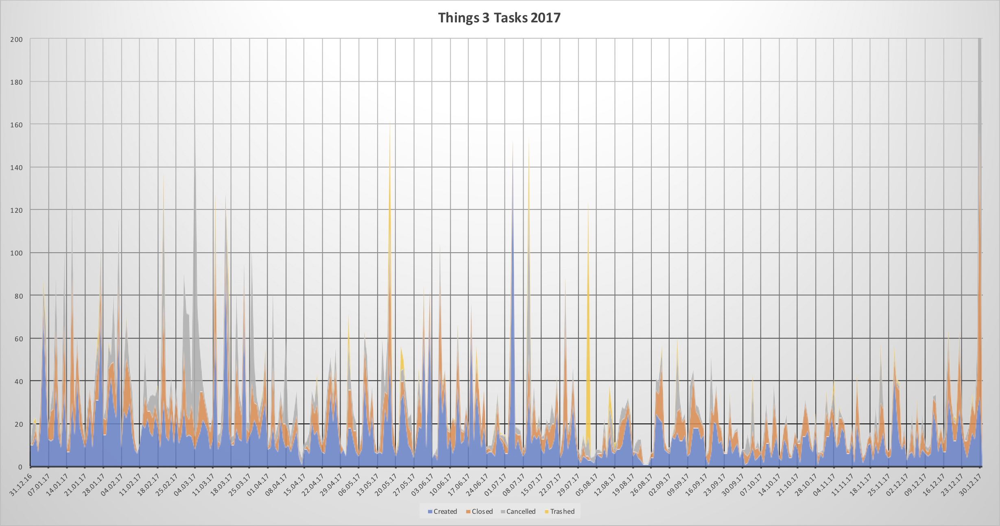

# Things 3 CLI

## Overview

Simple read-only comand-line interface to your Things 3 database (incl. CSV export). Since Things uses a SQLite database (which should come pre-installed on your Mac) we can simply query it straight from the command line. We only do read operations since we don't want to mess up your data.

[](https://travis-ci.org/AlexanderWillner/things.sh)

## Installation

You can use [brew](https://brew.sh) to install and later update the script:

 - Prepare: ```brew tap AlexanderWillner/tap```
 - Install: ```brew install things.sh```
 - Upgrade: ```brew upgrade```
 
## Example Graphs

These graphs have been generated based on the CSV export.






## Instructions

Note that you could override the location of the database used by setting the THINGSDB environment variable. For usage information, run the script with no arguments or with "help":

```
$ things.sh --limitBy 5 help
usage: things.sh <OPTIONS> [COMMAND]

List to do items from your Things database given a focus area.

COMMAND:
  inbox
  today
  upcoming
  next / anytime
  someday
  completed
  cancelled
  trashed
  all           (show all tasks)
  nextish       (show 5 next tasks that are also in someday projects)
  old           (show 5 tasks ordered by 'creationDate')
  due           (show 5 tasks ordered by due date)
  waiting       (show 5 tasks with the tag 'Waiting for' ordered by 'creationDate')
  repeating     (show 5 repeating tasks orderd by 'creationDate')
  subtasks      (show 5 subtasks)
  projects      (show 5 projects ordered by creation date)
  headings      (show 5 headings ordered by creation date)
  notes         (show 5 notes as <headings>: <notes> ordered by creation date)
  csv           (export all tasks as semicolon seperated values incl. notes and Excel friendly)
  stat          (provide an overview of the numbers of tasks)
  statcsv       (export some statistics as semicolon seperated values for '-1 year')
  mostClosed    (show 5 days on which most tasks were closed)
  mostCreated   (show 5 days on which most tasks were created)
  mostCancelled (show 5 days on which most tasks were cancelled)
  mostTrashed   (show 5 days on which most tasks were trashed)
  mostTasks     (show 5 projects which have most tasks)
  mostCharacters(show 5 tasks which have most characters)
  search        (provide details about specific tasks)
  feedback      (give feedback, request and propose changes)

OPTIONS:
  -l|--limitBy <number>    Limit output by <number> of results
  -w|--waitingTag <tag>    Set waiting tag to <tag>
  -o|--orderBy <column>    Sort output by <column> (e.g. 'userModificationDate' or 'creationDate')
  -s|--string <string>     String <string> to search for
  -r|--range <string>      Limit CSV statistic export by <string>
```

## Examples 

### CSV export and open with Excel

```things.sh csv > Things3Export.csv ; open Things3Export.csv```

### Statistics

```
$ things.sh stat
Inbox     : 0
Today     : 2
Upcoming  : 156
Next      : 6
Someday   : 823

Completed : 11964
Cancelled : 9245
Trashed   : 541

Tasks     : 968
Subtasks  : 56
Waiting   : 114
Projects  : 97
Repeating : 91
Nextish   : 145
Headings  : 41

Oldest    : 2010-09-28|XXX
Farest    : 2021-01-04|XXX
Longest   : 167|XXXXXXXXXX
Largest   : 127|XXXXXXXXXX

Created   : 147|2017-07-04
Closed    : 124|2017-12-30
Cancelled : 324|2017-12-30
Trashed   : 109|2017-08-02
Days/Task : 41.0
```

## CREDITS
 * Author        : Arjan van der Gaag (script for Things 2)
 * Author        : Alexander Willner (updates for Things 3, added many more commands, a lot refactoring)
 * License       : Whatever. Use at your own risk.
 * Source        : https://github.com/AlexanderWillner/things.sh
 * Shell checker : https://github.com/koalaman/shellcheck
 * Shell cleanup : https://github.com/mvdan/sh/
 * Shell tips    : https://dev.to/thiht/shell-scripts-matter
 * Shell tips    : https://google.github.io/styleguide/shell.xml
 * Shell tips    : https://kvz.io/blog/2013/11/21/bash-best-practices/
 * Shell tips.   : https://github.com/progrium/bashstyle
 
